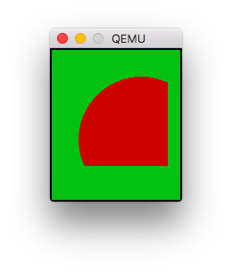

special-draw-mask
=================

```c
GSpecialSessionModifier *
    graphics_special_draw_create_mask_modifier();
```

Creates a mask modifier.

```c
void graphics_special_draw_mask_modifier_update(
    GSpecialSession * session,
    GSpecialSessionModifier * modifier,
    bool use_true_background);`
```

Updates the modifier, clearing the offscreen framebuffer and
using its alpha values to populate a mask (which will be used
when the modifier is run.)

Calling this function between the time the modifier is
created and the session is ended is **required**, and
failing to do so leads to undefined behavior.

Since Pebble's graphics functions don't fully support transparency,
`use_true_background = true` is recommended whenever drawing
antialiased shapes. For the same reason, shapes with antialiasing
should be drawn _after_ the update. However, using it may cause
some other modifiers, such as rotation, not to work as intended.

Usage
-----

```c
graphics_context_set_fill_color(ctx, GColorGreen);
graphics_fill_rect(ctx, GRect(0, 0, 144, 168), 0, GCornerNone);

GSpecialSession * session =
    graphics_context_begin_special_draw(ctx);
GSpecialSessionModifier * mask_mod =
    graphics_special_draw_create_mask_modifier();
graphics_context_special_session_add_modifier(session, mask_mod);

// Setting the color for demonstration purposes only.
// The blue won't be visible.
graphics_context_set_fill_color(ctx, GColorBlue);
graphics_draw_circle(ctx, GPoint(100, 100), 70);

// Use that circle as our mask.
graphics_special_draw_mask_modifier_update(session, mask_mod, true);

graphics_context_set_fill_color(ctx, GColorRed);
graphics_fill_rect(ctx, GRect(0, 0, 130, 130), 0, GCornerNone);

graphics_context_end_special_draw(session);

// We have now drawn a portion of a circle.
```

Result:


